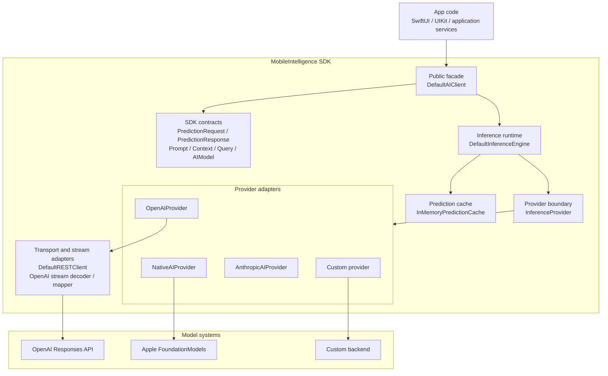

# MobileIntelligence
[](https://github.com/Conficle/MobileIntelligence/actions/workflows/ci.yml)

MobileIntelligence is a vendor-agnostic AI SDK for Apple platforms that provides a unified API for cloud and on-device foundation models.

Build AI-powered iOS applications without coupling your code to a specific AI vendor. Write inference code once and switch between OpenAI, Apple Foundation Models, or your own backend through a consistent, Swift Concurrency-first API.

MobileIntelligence separates inference orchestration from provider implementations, allowing providers to focus on AI integration while the inference engine handles request execution, streaming, response normalization, and caching.

Write inference code once and switch between providers such as OpenAI, Apple Foundation Models, Anthropic, or your own backend without changing your application code.

- [Why MobileIntelligence?](#why-mobileintelligence)
- [Features](#features)
- [Quick Start](#write-predictions-fast)
- [Requirements](#requirements)
- [Installation](#installation)
- [Architecture](#architecture)
- [Usage](#usage)
- [Prediction Caching](#prediction-caching)
- [Core Concepts](#core-concepts)
- [Providers](#providers)
- [Demo App](#demo-app)
- [Project Layout](#project-layout)
- [Roadmap](#roadmap)
- [License](#license)

## Why MobileIntelligence?

MobileIntelligence is designed around a simple idea:

> Your application should depend on AI capabilities, not AI vendors.

### Design Principles

- ✅ Vendor-agnostic inference API
- ✅ Cloud and on-device AI through a unified interface
- ✅ Swift Concurrency-first architecture using actors
- ✅ Built-in streaming and response caching
- ✅ Extensible provider architecture
- ✅ Clean separation between application, inference engine, and providers

Applications interact with a single inference API while providers encapsulate vendor-specific implementation details. This enables switching AI providers with minimal application changes.

## Features

- [x] Vendor-agnostic prediction API.
- [x] OpenAI and Apple Foundation Models support.
- [x] Custom provider support through `InferenceProvider`.
- [x] Swift Concurrency-first architecture using actors.
- [x] Streaming inference using `AsyncThrowingStream`.
- [x] Shared prediction caching with configurable cache policies.
- [x] Native Apple inference using `FoundationModels`.
- [x] OpenAI Responses API integration.
- [x] Typed prediction requests and normalized responses.
- [x] SwiftUI demo application.
- [x] Comprehensive unit test coverage.

## Quick Start

```swift
import MobileIntelligence

let client = DefaultAIClient()
let provider = OpenAIProvider(configuration: .init(apiKey: "YOUR_API_KEY"))

await client.bootstrapInference(provider, model: OpenAIModelType.gpt5_6)

let response = try await client.predict(
    forRequest: PredictionRequest(
        prompt: Prompt(instructions: "Answer clearly and concisely."),
        context: Context(),
        query: Query(question: "What is MobileIntelligence?"),
        temperature: 0.7,
        maxTokens: 500,
        reasoning: .medium,
        cachePolicy: .automatic
    )
)

print(response.content)
```

## Requirements

| Platform | Minimum Version | Notes |
| --- | --- | --- |
| iOS | 18.0+ | Required by the Swift package manifest. |
| iOS native inference | 26.0+ | Required for `FoundationModels` and `NativeAIProvider`. |
| Swift | 6.0+ | Required by `Package.swift`. |
| Xcode | Swift 6 capable | Required to build the package and demo app. |

## Installation

### Swift Package Manager

Add MobileIntelligence to your package dependencies:

```swift
dependencies: [
    .package(url: "https://github.com/<owner>/MobileIntelligence.git", from: "0.1.0")
]
```

Then add the product to your target:

```swift
.product(name: "MobileIntelligence", package: "MobileIntelligence")
```

You can also add the repository URL directly in Xcode through **File > Add Package Dependencies**.

## Architecture



## Usage

### OpenAI

```swift
import MobileIntelligence

let client = DefaultAIClient()
let provider = OpenAIProvider(configuration: .init(apiKey: "YOUR_API_KEY"))

await client.bootstrapInference(provider, model: OpenAIModelType.gpt5_6)

let request = PredictionRequest(
    prompt: Prompt(instructions: "Respond as a helpful mobile assistant."),
    context: Context(),
    query: Query(question: "Summarize the benefits of on-device AI."),
    temperature: 0.7,
    maxTokens: 300,
    reasoning: .medium,
    cachePolicy: .automatic
)

let response = try await client.predict(forRequest: request)
print(response.content)
```

### Native Apple Inference

Native inference is available through `NativeAIProvider` on iOS 26 and later.

```swift
import MobileIntelligence

if #available(iOS 26.0, *) {
    let client = DefaultAIClient()
    let provider = NativeAIProvider()

    await client.bootstrapInference(provider, model: NativeModelType.system)

    let request = PredictionRequest(
        prompt: Prompt(instructions: "Answer in a short sentence."),
        context: Context(),
        query: Query(question: "What is on-device AI?"),
        temperature: 0.7,
        maxTokens: 100,
        reasoning: .medium
    )

    let response = try await client.predict(forRequest: request)
    print(response.content)
}
```

### Typed FoundationModels Generation

Use the Apple-specific client API when you need a `Generable` response type.

```swift
import FoundationModels
import MobileIntelligence

if #available(iOS 26.0, *) {
    let client = DefaultAIClient()
    let provider = NativeAIProvider()

    await client.bootstrapInference(provider, model: NativeModelType.system)

    let request = PredictionRequest(
        prompt: Prompt(instructions: "Answer in a short sentence."),
        context: Context(),
        query: Query(question: "What is on-device AI?"),
        temperature: 0.7,
        maxTokens: 100,
        reasoning: .medium
    )

    let result: String = try await client.predict(
        forRequest: request,
        generating: String.self
    )

    print(result)
}
```

### Streaming Responses

Use the streaming API when you want to consume tokens as they arrive from the selected provider.

```swift
import MobileIntelligence

let client = DefaultAIClient()
let provider = OpenAIProvider(configuration: .init(apiKey: "YOUR_API_KEY"))

await client.bootstrapInference(provider, model: OpenAIModelType.gpt5_6)

let request = PredictionRequest(
    prompt: Prompt(instructions: "Respond in short bursts."),
    context: Context(),
    query: Query(question: "Explain streaming in one sentence."),
    temperature: 0.7,
    maxTokens: 300,
    reasoning: .medium,
    cachePolicy: .automatic
)

let stream = try await client.stream(for: request)

for try await event in stream {
    switch event {
    case .started:
        print("Streaming started")
    case .textDelta(let delta):
        print(delta, terminator: "")
    case .completed(let response):
        print("\nCompleted: \(response.content)")
    }
}
```

### Custom Providers

Implement `InferenceProvider` to plug in your own backend.

```swift
actor MyProvider: InferenceProvider {
    func bootstrap(withModel model: any AIModel) async {
        // Prepare your backend for the selected model.
    }

    func predict(forRequest request: PredictionRequest) async throws -> PredictionResponse {
        // Call your backend and normalize its output.
        PredictionResponse(content: "Hello from a custom provider")
    }
}
```

## Prediction Caching

MobileIntelligence caches successful predictions before delegating to the underlying provider.

The standard `client.predict(forRequest:)` and `client.stream(for:)` paths use a shared in-memory cache keyed by a deterministic, versioned SHA-256 signature that includes:

- provider identity
- selected model name
- prompt instructions
- user query
- temperature
- max token limit
- reasoning effort
- context fingerprint

If the same provider/model/request combination is sent again through the client, the cached response is returned without invoking the provider by default.

Each `PredictionRequest` can choose its cache behavior:

```swift
let request = PredictionRequest(
    prompt: Prompt(instructions: "Answer from the current request."),
    context: Context(),
    query: Query(question: "What changed since the last response?"),
    temperature: nil,
    maxTokens: nil,
    reasoning: .medium,
    cachePolicy: .reload
)
```

Available cache policies:

- `.automatic` returns a cached response when one exists, otherwise calls the provider and stores the successful response.
- `.reload` skips cached reads, calls the provider, and stores the fresh successful response.
- `.cacheOnly` returns a cached response when one exists and throws `CoreError.cacheMiss` when the cache does not contain a response.

Current cache behavior:

- actor-safe
- in-memory
- process-lifetime only
- successful responses only
- applied to standard prediction and streaming paths

Direct provider calls and typed Apple `Generable` predictions do not currently use this cache path.

## Core Concepts

### `DefaultAIClient`

The primary entry point for app code. It owns the inference engine and exposes prediction APIs through `InferenceClient`.

### `InferenceProvider`

The backend contract for prediction providers. Providers are actors and support bootstrapping with a model before prediction.

### `PredictionRequest`

The request payload passed into providers. It includes prompt instructions, context, user query, temperature, token limit, reasoning effort, and cache policy.

### `PredictionResponse`

The normalized response returned from prediction calls. It currently exposes generated text through `content`.

### `AppleInferenceClient`

An iOS 26+ API for typed Apple `FoundationModels` generation using `Generable` output types.

## Providers

| Provider | Status | Notes |
| --- | --- | --- |
| Apple Foundation Models | ✅ Implemented | Native on-device inference with typed `Generable` support. |
| OpenAI | ✅ Implemented | Responses API with streaming support. |
| Custom Providers | ✅ Supported | Implement `InferenceProvider` to integrate your own backend. |
| Anthropic | 🚧 Planned | Scheduled for a future release. |

## Demo App

The repository includes a SwiftUI demo app:

```text
Demo/MobileIntelligenceDemo
```

The demo app shows provider selection, model selection, cache policy selection, prompt and query input, request construction, client bootstrapping, response rendering, and a streaming toggle that switches between standard prediction and streamed responses.

Open the Xcode project to run it locally:

```text
Demo/MobileIntelligenceDemo/MobileIntelligenceDemo.xcodeproj
```

## Project Layout

```text
MobileIntelligence/
  Sources/MobileIntelligence/
    Public/
      Client/
      Inference/
      Models/
      Provider/
    Private/
      Infrastructure/
Demo/
  MobileIntelligenceDemo/
```

## Roadmap

### v0.2.0

- Prompt Builder
- Prompt Templates
- Prompt Rendering
- Prompt Validation

### v0.3.0

- Structured Output
- Embeddings
- Persistent Prediction Cache
- Cache Expiration Policies

### v0.4.0

- Anthropic Provider
- Enhanced Provider Authentication
- Additional Streaming Enhancements

### Future

- Vision Models
- Audio Understanding
- Tool Calling
- Conversation Memory
- Retrieval-Augmented Generation (RAG)
- Agent Workflows

## Vision

MobileIntelligence aims to become a comprehensive AI SDK for Apple platforms.

Beyond inference, future modules will include Prompt Engineering, Structured Output, Embeddings, Vision, Tool Calling, Retrieval-Augmented Generation (RAG), and Agent workflows—all exposed through a consistent, provider-agnostic architecture.

The goal is to allow applications to adopt new AI capabilities without rewriting application code or becoming tightly coupled to individual AI vendors.

## License

MobileIntelligence is released under the Apache License 2.0. See [LICENSE](LICENSE) for details.
