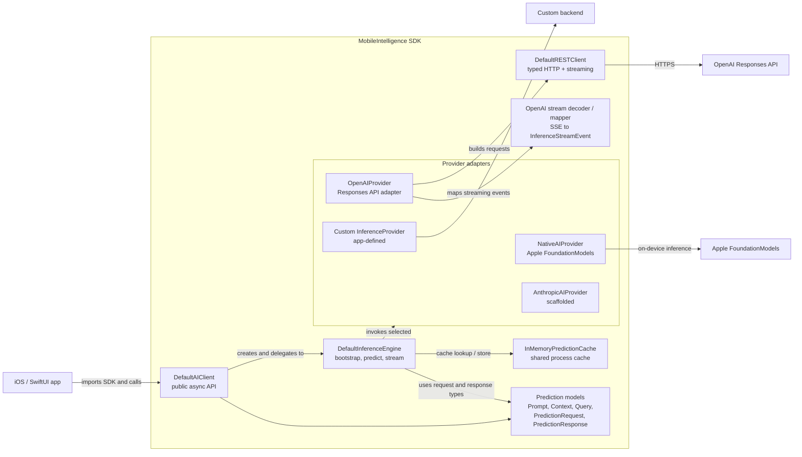
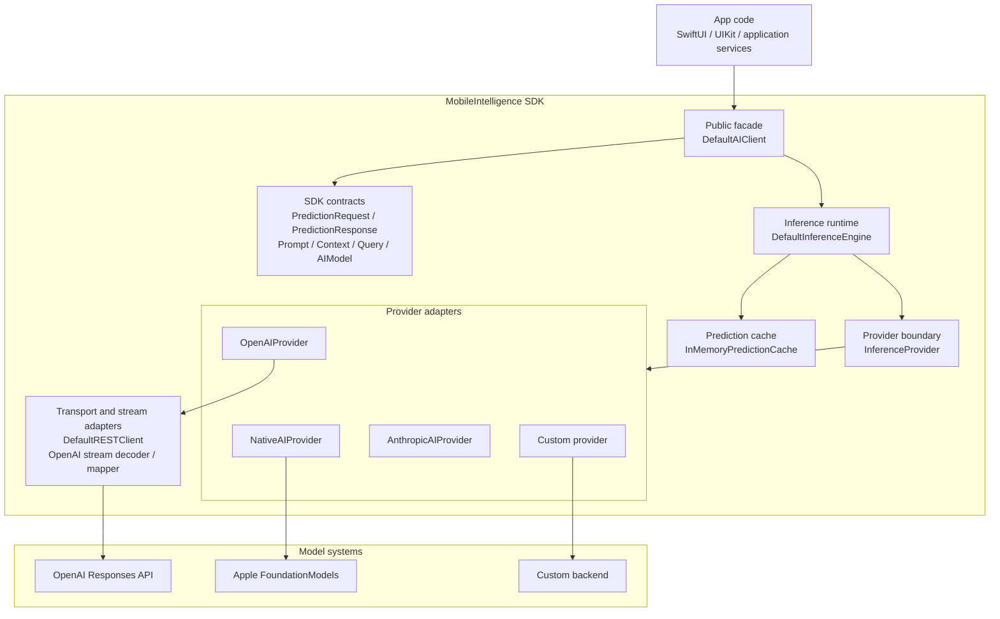

# MobileIntelligence

MobileIntelligence is a vendor-agnostic AI SDK for Apple platforms that provides a unified API for cloud and on-device foundation models.

It gives your app one consistent client surface for native Apple inference, OpenAI, Anthropic, and custom providers while keeping request construction, model selection, and response handling small and testable.

Write inference code once and switch between providers such as OpenAI, Apple Foundation Models, Anthropic, or your own backend without changing your application code.

- [Features](#features)
- [Quick Start](#write-predictions-fast)
- [Requirements](#requirements)
- [Installation](#installation)
- [Architecture](#architecture)
- [Usage](#usage)
- [Prediction Caching](#prediction-caching)
- [Core Concepts](#core-concepts)
- [Providers](#providers)
- [Demo App](#demo-app)
- [Project Layout](#project-layout)
- [Roadmap](#roadmap)
- [License](#license)

## Features

- [x] Provider-based prediction API for Apple, OpenAI   , and custom backends.
- [x] Swift Concurrency first, with actor-backed clients and providers.
- [x] Native Apple inference using `FoundationModels` on supported OS versions.
- [x] OpenAI Responses API integration through a lightweight REST layer.
- [x] Typed prediction requests with prompt, context, query, temperature, token limit, reasoning effort, and cache policy.
- [x] Normalized text responses through `PredictionResponse`.
- [x] Shared in-memory prediction caching for repeated provider/model/request combinations, with request-level cache policy controls.
- [x] Streaming inference support for progressively consuming provider responses.
- [x] SwiftUI demo app for provider selection, streaming toggle, cache policy selection, and prediction flow.
- [x] Unit coverage for clients, providers, REST infrastructure, models, and caching behavior.

## Quick Start

```swift
import MobileIntelligence

let client = DefaultAIClient()
let provider = OpenAIProvider(configuration: .init(apiKey: "YOUR_API_KEY"))

await client.bootstrapInference(provider, model: OpenAIModelType.gpt5_6)

let response = try await client.predict(
    forRequest: PredictionRequest(
        prompt: Prompt(instructions: "Answer clearly and concisely."),
        context: Context(),
        query: Query(question: "What is MobileIntelligence?"),
        temperature: 0.7,
        maxTokens: 500,
        reasoning: .medium,
        cachePolicy: .automatic
    )
)

print(response.content)
```

## Requirements

| Platform | Minimum Version | Notes |
| --- | --- | --- |
| iOS | 18.0+ | Required by the Swift package manifest. |
| iOS native inference | 26.0+ | Required for `FoundationModels` and `NativeAIProvider`. |
| Swift | 6.0+ | Required by `Package.swift`. |
| Xcode | Swift 6 capable | Required to build the package and demo app. |

## Installation

### Swift Package Manager

Add MobileIntelligence to your package dependencies:

```swift
dependencies: [
    .package(url: "https://github.com/<owner>/MobileIntelligence.git", branch: "main")
]
```

Then add the product to your target:

```swift
.product(name: "MobileIntelligence", package: "MobileIntelligence")
```

You can also add the repository URL directly in Xcode through **File > Add Package Dependencies**.

## Architecture

### Component Flow



### Block Diagram



## Usage

### OpenAI

```swift
import MobileIntelligence

let client = DefaultAIClient()
let provider = OpenAIProvider(configuration: .init(apiKey: "YOUR_API_KEY"))

await client.bootstrapInference(provider, model: OpenAIModelType.gpt5_6)

let request = PredictionRequest(
    prompt: Prompt(instructions: "Respond as a helpful mobile assistant."),
    context: Context(),
    query: Query(question: "Summarize the benefits of on-device AI."),
    temperature: 0.7,
    maxTokens: 300,
    reasoning: .medium,
    cachePolicy: .automatic
)

let response = try await client.predict(forRequest: request)
print(response.content)
```

### Native Apple Inference

Native inference is available through `NativeAIProvider` on iOS 26 and later.

```swift
import MobileIntelligence

if #available(iOS 26.0, *) {
    let client = DefaultAIClient()
    let provider = NativeAIProvider()

    await client.bootstrapInference(provider, model: NativeModelType.system)

    let request = PredictionRequest(
        prompt: Prompt(instructions: "Answer in a short sentence."),
        context: Context(),
        query: Query(question: "What is on-device AI?"),
        temperature: 0.7,
        maxTokens: 100,
        reasoning: .medium
    )

    let response = try await client.predict(forRequest: request)
    print(response.content)
}
```

### Typed FoundationModels Generation

Use the Apple-specific client API when you need a `Generable` response type.

```swift
import FoundationModels
import MobileIntelligence

if #available(iOS 26.0, *) {
    let client = DefaultAIClient()
    let provider = NativeAIProvider()

    await client.bootstrapInference(provider, model: NativeModelType.system)

    let request = PredictionRequest(
        prompt: Prompt(instructions: "Answer in a short sentence."),
        context: Context(),
        query: Query(question: "What is on-device AI?"),
        temperature: 0.7,
        maxTokens: 100,
        reasoning: .medium
    )

    let result: String = try await client.predict(
        forRequest: request,
        generating: String.self
    )

    print(result)
}
```

### Streaming Responses

Use the streaming API when you want to consume tokens as they arrive from the selected provider.

```swift
import MobileIntelligence

let client = DefaultAIClient()
let provider = OpenAIProvider(configuration: .init(apiKey: "YOUR_API_KEY"))

await client.bootstrapInference(provider, model: OpenAIModelType.gpt5_6)

let request = PredictionRequest(
    prompt: Prompt(instructions: "Respond in short bursts."),
    context: Context(),
    query: Query(question: "Explain streaming in one sentence."),
    temperature: 0.7,
    maxTokens: 300,
    reasoning: .medium,
    cachePolicy: .automatic
)

let stream = try await client.stream(for: request)

for try await event in stream {
    switch event {
    case .started:
        print("Streaming started")
    case .textDelta(let delta):
        print(delta, terminator: "")
    case .completed(let response):
        print("\nCompleted: \(response.content)")
    }
}
```

### Custom Providers

Implement `InferenceProvider` to plug in your own backend.

```swift
actor MyProvider: InferenceProvider {
    func bootstrap(withModel model: any AIModel) async {
        // Prepare your backend for the selected model.
    }

    func predict(forRequest request: PredictionRequest) async throws -> PredictionResponse {
        // Call your backend and normalize its output.
        PredictionResponse(content: "Hello from a custom provider")
    }
}
```

## Prediction Caching

MobileIntelligence caches successful predictions before delegating to the underlying provider.

The standard `client.predict(forRequest:)` and `client.stream(for:)` paths use a shared in-memory cache keyed by a deterministic, versioned SHA-256 signature that includes:

- provider identity
- selected model name
- prompt instructions
- user query
- temperature
- max token limit
- reasoning effort
- context fingerprint

If the same provider/model/request combination is sent again through the client, the cached response is returned without invoking the provider by default.

Each `PredictionRequest` can choose its cache behavior:

```swift
let request = PredictionRequest(
    prompt: Prompt(instructions: "Answer from the current request."),
    context: Context(),
    query: Query(question: "What changed since the last response?"),
    temperature: nil,
    maxTokens: nil,
    reasoning: .medium,
    cachePolicy: .reload
)
```

Available cache policies:

- `.automatic` returns a cached response when one exists, otherwise calls the provider and stores the successful response.
- `.reload` skips cached reads, calls the provider, and stores the fresh successful response.
- `.cacheOnly` returns a cached response when one exists and throws `CoreError.cacheMiss` when the cache does not contain a response.

Current cache behavior:

- actor-safe
- in-memory
- process-lifetime only
- successful responses only
- applied to standard prediction and streaming paths

Direct provider calls and typed Apple `Generable` predictions do not currently use this cache path.

## Core Concepts

### `DefaultAIClient`

The primary entry point for app code. It owns the inference engine and exposes prediction APIs through `InferenceClient`.

### `InferenceProvider`

The backend contract for prediction providers. Providers are actors and support bootstrapping with a model before prediction.

### `PredictionRequest`

The request payload passed into providers. It includes prompt instructions, context, user query, temperature, token limit, reasoning effort, and cache policy.

### `PredictionResponse`

The normalized response returned from prediction calls. It currently exposes generated text through `content`.

### `AppleInferenceClient`

An iOS 26+ API for typed Apple `FoundationModels` generation using `Generable` output types.

## Providers

| Provider | Status | Notes |
| --- | --- | --- |
| Native Apple | Implemented | Uses `FoundationModels`, requires iOS 26+, and supports typed `Generable` output. |
| OpenAI | Implemented | Uses `OpenAIProvider`, `DefaultRESTClient`, and `OpenAIModelType`. |
| Anthropic | Scaffolded | `AnthropicAIProvider` exists, but inference is currently a placeholder. |
| Custom | Supported | Implement `InferenceProvider` to add your own backend. |

## Demo App

The repository includes a SwiftUI demo app:

```text
Demo/MobileIntelligenceDemo
```

The demo app shows provider selection, model selection, cache policy selection, prompt and query input, request construction, client bootstrapping, response rendering, and a streaming toggle that switches between standard prediction and streamed responses.

Open the Xcode project to run it locally:

```text
Demo/MobileIntelligenceDemo/MobileIntelligenceDemo.xcodeproj
```

## Project Layout

```text
MobileIntelligence/
  Sources/MobileIntelligence/
    Public/
      Client/
      Inference/
      Models/
      Provider/
    Private/
      Infrastructure/
Demo/
  MobileIntelligenceDemo/
```

## Roadmap

- Complete Anthropic inference.
- Expand streaming support to additional provider-specific event handling.
- Add structured response helpers.
- Expand context handling.
- Add persistent cache storage, TTLs, and eviction policies.
- Add cache support for typed Apple generation.
- Add richer provider authentication configuration.
- Add integration tests against live provider sandboxes.

## License

MobileIntelligence is released under the Apache License 2.0. See [LICENSE](LICENSE) for details.
