# MobileIntelligence SDK C3 Component Diagram

This C4 level 3 component diagram shows the primary runtime components inside the
`MobileIntelligence` Swift package and the external systems they adapt.

```mermaid
C4Component
title MobileIntelligence SDK - C3 Component Diagram

Person(app, "iOS app", "Imports MobileIntelligence and calls the public SDK API")
System_Ext(openai, "OpenAI Responses API", "Remote model inference and streamed server-sent events")
System_Ext(foundationModels, "Apple FoundationModels", "On-device system language model")
System_Ext(customBackend, "Custom provider backend", "User-supplied inference service or local implementation")

Container_Boundary(sdk, "MobileIntelligence Swift Package") {
  Component(client, "DefaultAIClient", "Swift actor / AIClient", "Public entry point for bootstrapping, prediction, and streaming")
  Component(inferenceClient, "InferenceClient", "Protocol", "Public client contract for inference capabilities")
  Component(factory, "DefaultClientFactory", "Swift actor", "Builds inference engines and shares the process-lifetime prediction cache")
  Component(engine, "DefaultInferenceEngine", "Swift actor / InferenceEngine", "Coordinates provider bootstrap, cache lookup/storage, prediction, and stream completion")
  Component(cache, "InMemoryPredictionCache", "Swift actor / PredictionCache", "Stores successful prediction responses by deterministic request signature")
  Component(responseBuilder, "PredictionResponseBuilder", "Internal helper", "Aggregates streaming text deltas into a normalized PredictionResponse")

  Component(providerContract, "InferenceProvider", "Protocol", "Backend contract implemented by all inference providers")
  Component(openAIProvider, "OpenAIProvider", "Swift actor", "Adapts PredictionRequest to the OpenAI Responses API and maps responses back to SDK models")
  Component(nativeProvider, "NativeAIProvider", "Swift actor / AppleInferenceProvider", "Wraps Apple FoundationModels text, streaming, and typed Generable inference")
  Component(anthropicProvider, "AnthropicAIProvider", "Swift actor", "Scaffolded provider that currently returns placeholder inference results")
  Component(customProvider, "Custom InferenceProvider", "User implementation", "Extension point for app-specific providers")

  Component(restClient, "DefaultRESTClient", "Swift actor / RESTClient", "Builds URLRequest values, sends HTTP requests, validates responses, and decodes JSON")
  Component(restRequest, "RESTRequest", "Typed request model", "Captures endpoint, method, headers, body, query items, timeout, and expected response type")
  Component(openAIModels, "OpenAI request/response models", "Codable DTOs", "Encode Responses API payloads and extract normalized output text")
  Component(streamingAdapter, "OpenAI streaming adapter", "Decoder + mapper", "Decodes OpenAI SSE lines and maps text deltas into InferenceStreamEvent values")

  Component(dataModels, "Prediction and model types", "Public value models", "PredictionRequest, PredictionResponse, InferenceStreamEvent, AIModel, Prompt, Context, Query, ProviderType")
}

Rel(app, client, "Bootstraps providers and runs predictions", "Swift async/await")
Rel(client, inferenceClient, "Implements")
Rel(client, factory, "Requests engine for selected provider and model")
Rel(factory, engine, "Creates")
Rel(factory, cache, "Shares")
Rel(client, engine, "Delegates predict and stream calls")

Rel(engine, providerContract, "Bootstraps and invokes")
Rel(engine, cache, "Reads before provider calls; stores successful results")
Rel(engine, responseBuilder, "Builds cached response from streamed deltas")
Rel(engine, dataModels, "Consumes requests and returns responses/events")

Rel(providerContract, openAIProvider, "Implemented by")
Rel(providerContract, nativeProvider, "Implemented by")
Rel(providerContract, anthropicProvider, "Implemented by")
Rel(providerContract, customProvider, "Implemented by")

Rel(openAIProvider, restRequest, "Builds typed Responses API requests")
Rel(openAIProvider, restClient, "Sends prediction and streaming requests")
Rel(openAIProvider, openAIModels, "Encodes and decodes OpenAI payloads")
Rel(openAIProvider, streamingAdapter, "Decodes and maps SSE stream events")
Rel(restClient, openai, "POST /v1/responses and stream bytes", "HTTPS")

Rel(nativeProvider, foundationModels, "Creates LanguageModelSession and requests responses", "FoundationModels")
Rel(customProvider, customBackend, "Calls custom implementation", "App-defined")

Rel(openAIProvider, dataModels, "Maps SDK requests/responses")
Rel(nativeProvider, dataModels, "Maps SDK requests/responses")
Rel(anthropicProvider, dataModels, "Returns placeholder SDK responses")
Rel(customProvider, dataModels, "Uses SDK request/response contract")
```

## Component Notes

| Component | Responsibility |
| --- | --- |
| `DefaultAIClient` | Public actor-backed SDK facade used by app code. |
| `DefaultClientFactory` | Creates `DefaultInferenceEngine` instances and shares the default cache. |
| `DefaultInferenceEngine` | Owns the selected provider/model runtime path, applies cache behavior, and normalizes streaming completion. |
| `InMemoryPredictionCache` | Actor-safe in-memory cache keyed by provider, model, prompt, query, generation settings, reasoning effort, and context fingerprint. |
| `InferenceProvider` | Provider extension contract for OpenAI, Apple native inference, Anthropic, and custom backends. |
| `OpenAIProvider` | Converts SDK prediction requests into OpenAI Responses API requests and supports streaming through the REST layer. |
| `NativeAIProvider` | Uses `FoundationModels` on iOS 26+ for on-device text, stream, and typed `Generable` predictions. |
| `AnthropicAIProvider` | Present as a scaffold; inference and streaming currently return placeholder/empty results. |
| `DefaultRESTClient` | Internal HTTP abstraction used by OpenAI integration for typed JSON requests and streaming bytes. |
| Public models | Stable SDK data contracts for prompts, context, queries, models, requests, responses, errors, and stream events. |
